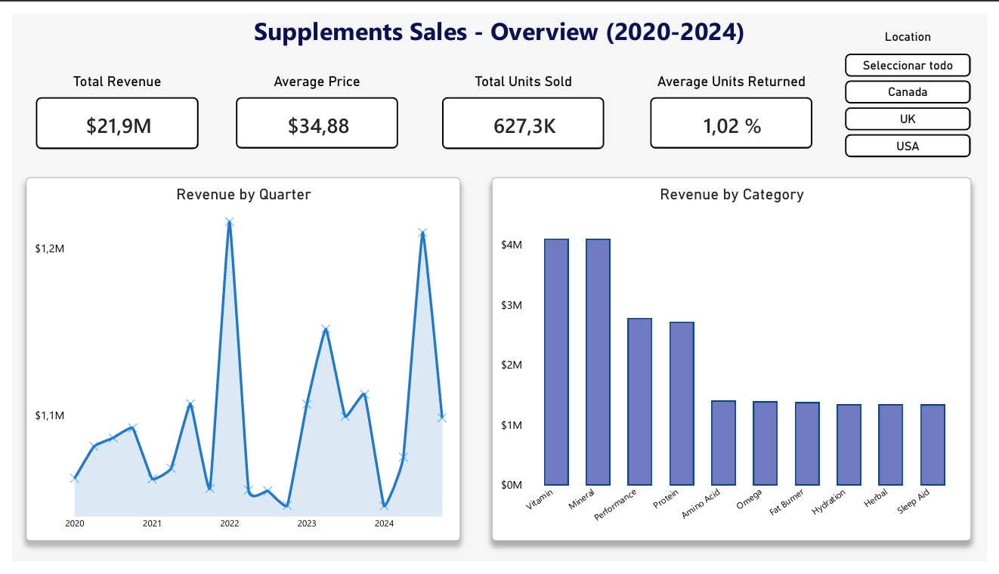
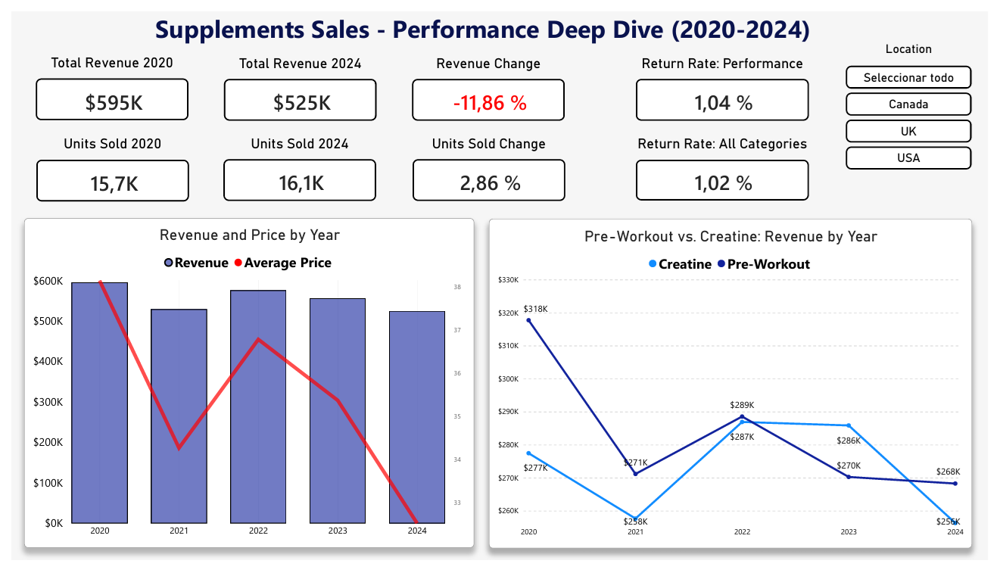
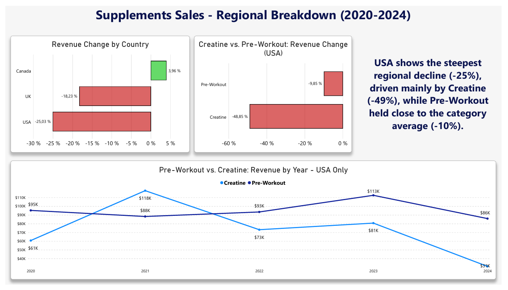
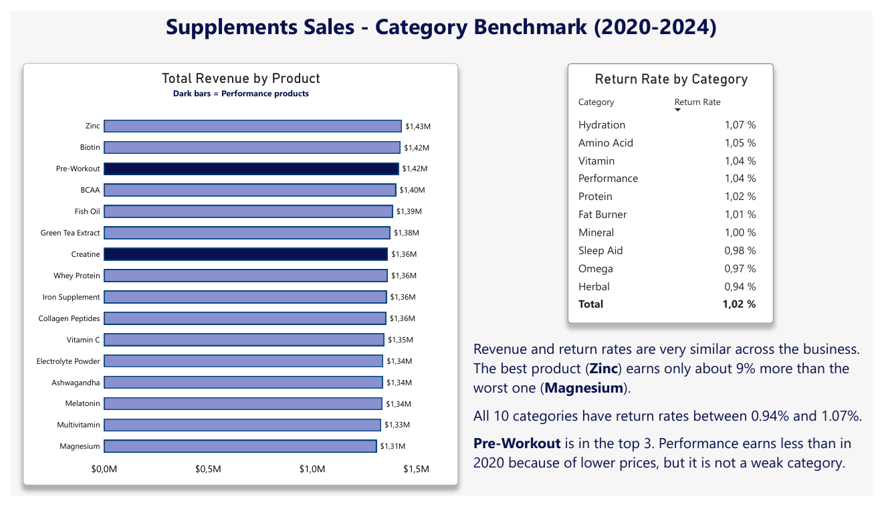

# Supplements Sales Analysis: Why Performance Fell (2020-2024)

## Overview

I analyzed 4,384 weekly sales records (January 2020 to March 2025) from a supplements business to answer one question: **why did performance fall between 2020 and 2024?**

The data covers 16 products, 10 categories, 3 countries and 3 sales platforms.

- **Tools:** Excel (Power Pivot) - SQL Server - Power BI (DAX)
- **Dataset:** "Supplement Sales Data" by Zahid Mughal, Kaggle (Apache 2.0 license). The source of the data is not stated on Kaggle. I modified it into 4 tables (1 fact table and 3 dimension tables).

---

## Key Findings

- **Performance is the only category that fell.** Its revenue dropped 11.86% between 2020 and 2024. Every other category grew.
- **It is a price problem, not a volume problem.** The average price in Performance fell 14.8% (from $38.15 to $32.51), while units sold grew 2.86%.
- **The drop is not the same in every country.** Canada grew 3.96%, the UK fell 18.23% and the USA fell 25.03%.
- **The biggest drop is USA Creatine.** Its revenue fell 48.85%, with units and price each down about 29%. Pre-Workout fell 9.85%.
- **Returns are not the cause.** Performance has a return rate of 1.04%, and the average is 1.02%. All categories sit between 0.94% and 1.07%.

---

## Project Structure

| File | Description |
|---|---|
| `data/Supplement_Sales_Weekly_Expanded.csv` | Original dataset downloaded from Kaggle |
| `data/fact_sales.csv` | Fact table: one row per week, product, platform and location |
| `data/dim_products.csv` | Product dimension (product and category) |
| `data/dim_platforms.csv` | Platform dimension |
| `data/dim_locations.csv` | Location dimension (country) |
| `Supplements_sales.xlsx` | Excel workbook: tables, Power Pivot model and 7 pivot tables |
| `supplements_queries.sql` | 10 SQL Server queries used to answer the main question |
| `supplements_sales.pbix` | Power BI dashboard (4 pages) |
| `screenshots/` | Dashboard images used in this README |

---

## Dashboard Preview

### Overview

### Performance

### Regional

### Benchmark

---

## Process

**1. Excel**
- Split the original file into 4 tables: 1 fact table and 3 dimension tables (star schema).
- Used INDEX/MATCH to replace text values with IDs.
- Built the data model in Power Pivot.
- Built 7 pivot tables to explore the data and find where the drop happened.

**2. SQL Server**
- Created the tables with primary keys and foreign keys.
- Loaded the CSV files. I imported the numbers as text, then used REPLACE and CAST to fix the decimal commas.
- Checked the load: 4,384 rows in the fact table.
- Wrote 20 practice queries to learn JOINs, CTEs and window functions.
- Wrote 10 final queries to answer the project question.

**3. Power BI**
- Connected directly to SQL Server.
- Built 4 pages: Overview, Performance, Regional and Benchmark.
- Wrote DAX measures with CALCULATE and REMOVEFILTERS (for example, revenue change % and share of total).
- I checked every number in the dashboard against the SQL queries.

---

## Notes and Limits

- The comparison is 2020 vs 2024. It is not a steady decline year by year.
- 2025 is excluded from the comparisons because it only has data up to March.
- The dataset has no cost data, so I could not analyze margin or profit.
- Q1 2022 was a peak, mainly because of price (see Query 7 in the SQL file).
- Mineral is the only category where the leader by units is different from the leader by revenue (see Query 4 in the SQL file).

---

*Project developed as part of a personal Data Analytics portfolio.*
